# ProImg — Complete Microservices Architecture & Code Flow Walkthrough
https://proimg-frontend.vercel.app/

## Table of Contents
- [System Overview](#system-overview)
- [Service Map & Ports](#service-map--ports)
- [Shared Module — The Foundation](#shared-module--the-foundation)
- [Gateway Service — The Front Door](#gateway-service--the-front-door)
- [Action Flows — Authentication](#action-flows--authentication)
- [Action Flows — User Management](#action-flows--user-management)
- [Action Flows — Pins](#action-flows--pins)
- [Action Flows — Chat & Messaging](#action-flows--chat--messaging)
- [Action Flows — Notifications](#action-flows--notifications)
- [RabbitMQ Event Topology](#rabbitmq-event-topology)
- [Cross-Service Data Replication](#cross-service-data-replication)
- [Frontend Architecture](#frontend-architecture)
- [Cron Jobs](#cron-jobs)

---

## System Overview

**ProImg** is a Pinterest-style image/video sharing platform built as **6 backend microservices + 1 React frontend**, communicating via an API Gateway and RabbitMQ message broker. Features include E2E encrypted messaging, privacy-gated profiles, and real-time notifications.

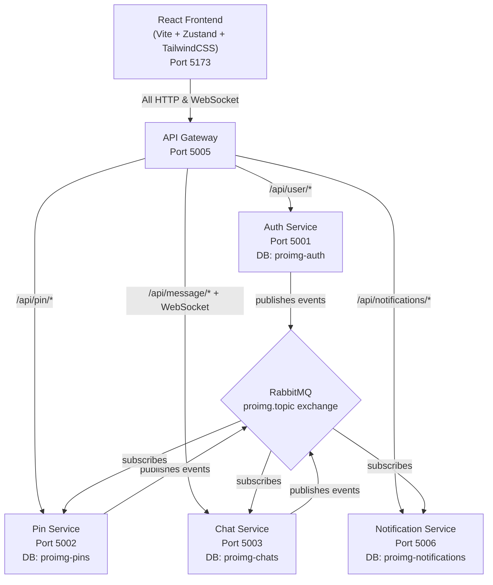
```mermaid
graph TD
    Client["React Frontend<br/>(Vite + Zustand + TailwindCSS)<br/>Port 5173"] -->|"All HTTP & WebSocket"| Gateway["API Gateway<br/>Port 5005"]
    
    Gateway -->|"/api/user/*"| Auth["Auth Service<br/>Port 5001<br/>DB: proimg-auth"]
    Gateway -->|"/api/pin/*"| Pin["Pin Service<br/>Port 5002<br/>DB: proimg-pins"]
    Gateway -->|"/api/message/* + WebSocket"| Chat["Chat Service<br/>Port 5003<br/>DB: proimg-chats"]
    Gateway -->|"/api/notifications/*"| Notif["Notification Service<br/>Port 5006<br/>DB: proimg-notifications"]
    
    Auth -->|"publishes events"| RMQ{"RabbitMQ<br/>proimg.topic exchange"}
    Pin -->|"publishes events"| RMQ
    Chat -->|"publishes events"| RMQ
    
    RMQ -->|"subscribes"| Pin
    RMQ -->|"subscribes"| Chat
    RMQ -->|"subscribes"| Notif
```

### Core Architectural Patterns
| Pattern | Implementation |
|---|---|
| **API Gateway** | Single entry point on port 5005; proxies all HTTP + WebSocket traffic |
| **Database-per-Service** | Each service owns its own MongoDB database — zero shared databases |
| **Event-Driven** | RabbitMQ topic exchange (`proimg.topic`) for async cross-service communication |
| **CQRS / Materialized Views** | `UserReplica` models in Pin & Chat services for local joins without network calls |
| **Dead Letter Queue** | Failed messages routed to `proimg.dlx` → `proimg.dlq` to prevent system stalls |
| **E2E Encryption** | RSA-OAEP + AES-GCM hybrid encryption for private messages |

---

## Service Map & Ports

| Service | Port | Database | Entry Point | Key Files |
|---|---|---|---|---|
| Gateway | 5005 | — | [server.js](file:///Users/pratik/folders/Proimg/ProImg/services/gateway/server.js) | Single file |
| Auth Service | 5001 | `proimg-auth` | [server.js](file:///Users/pratik/folders/Proimg/ProImg/services/auth-service/server.js) | [userControllers.js](file:///Users/pratik/folders/Proimg/ProImg/services/auth-service/controllers/userControllers.js), [userModel.js](file:///Users/pratik/folders/Proimg/ProImg/services/auth-service/models/userModel.js) |
| Pin Service | 5002 | `proimg-pins` | [server.js](file:///Users/pratik/folders/Proimg/ProImg/services/pin-service/server.js) | [pinControllers.js](file:///Users/pratik/folders/Proimg/ProImg/services/pin-service/controllers/pinControllers.js), [pinModel.js](file:///Users/pratik/folders/Proimg/ProImg/services/pin-service/models/pinModel.js) |
| Chat Service | 5003 | `proimg-chats` | [server.js](file:///Users/pratik/folders/Proimg/ProImg/services/chat-service/server.js) | [messageRoutes.js](file:///Users/pratik/folders/Proimg/ProImg/services/chat-service/routes/messageRoutes.js), [socketHandler.js](file:///Users/pratik/folders/Proimg/ProImg/services/chat-service/sockets/socketHandler.js) |
| Notification Service | 5006 | `proimg-notifications` | [server.js](file:///Users/pratik/folders/Proimg/ProImg/services/notification-service/server.js) | [eventHandlers.js](file:///Users/pratik/folders/Proimg/ProImg/services/notification-service/lib/eventHandlers.js), [scheduler.js](file:///Users/pratik/folders/Proimg/ProImg/services/notification-service/jobs/scheduler.js) |
| Shared Module | — | — | [index.js](file:///Users/pratik/folders/Proimg/ProImg/services/shared/index.js) | All utility files |
| Frontend | 5173 | — | [App.jsx](file:///Users/pratik/folders/Proimg/ProImg/frontend/src/App.jsx) | Stores, components, pages |

---

## Shared Module — The Foundation

The [shared](file:///Users/pratik/folders/Proimg/ProImg/services/shared) package is a local npm module used by **all** services. It eliminates boilerplate and enforces consistent patterns.

### All Exports

| Export | Source File | Purpose |
|---|---|---|
| `loadEnv`, `buildMongoUri`, `servicePort` | [env.js](file:///Users/pratik/folders/Proimg/ProImg/services/shared/env.js) | Loads root `.env`, builds per-service Mongo URIs, maps service→port env vars |
| `createLogger` | [logger.js](file:///Users/pratik/folders/Proimg/ProImg/services/shared/logger.js) | Winston logger — colorized dev format, JSON prod format |
| `connectDatabase`, `mongoose` | [database.js](file:///Users/pratik/folders/Proimg/ProImg/services/shared/database.js) | Mongoose connect with retry logic (5s delay), shares single mongoose instance |
| `isAuth` | [auth.js](file:///Users/pratik/folders/Proimg/ProImg/services/shared/auth.js) | Express middleware — verifies JWT from `token` cookie or `Authorization` header, sets `req.user` |
| `generateAccessToken` | [auth.js](file:///Users/pratik/folders/Proimg/ProImg/services/shared/auth.js) | Signs JWT `{id, email, name}` with `JWT_SEC`, **1 hour** expiry |
| `generateRefreshToken` | [auth.js](file:///Users/pratik/folders/Proimg/ProImg/services/shared/auth.js) | Signs JWT `{id, email}` with `REFRESH_TOKEN_SEC`, **7 day** expiry |
| `hashPassword`, `comparePassword` | [auth.js](file:///Users/pratik/folders/Proimg/ProImg/services/shared/auth.js) | bcrypt with salt rounds = 10 |
| `successResponse`, `errorResponse`, `errorHandler`, `AppError` | [response.js](file:///Users/pratik/folders/Proimg/ProImg/services/shared/response.js) | Standardized API responses with `{success, message, data}` envelope |
| `RabbitMQClient`, `EVENTS` | [rabbitmq.js](file:///Users/pratik/folders/Proimg/ProImg/services/shared/rabbitmq.js) | Full AMQP wrapper + event name constants |
| `publishSocialActivity` | [lib/socialEvents.js](file:///Users/pratik/folders/Proimg/ProImg/services/shared/lib/socialEvents.js) | Convenience wrapper to publish `social.activity` events |
| `setupGracefulShutdown` | [shutdown.js](file:///Users/pratik/folders/Proimg/ProImg/services/shared/shutdown.js) | Handles SIGTERM/SIGINT/uncaughtException — closes HTTP, RabbitMQ, Mongoose in order |

### RabbitMQClient — Key Behaviors

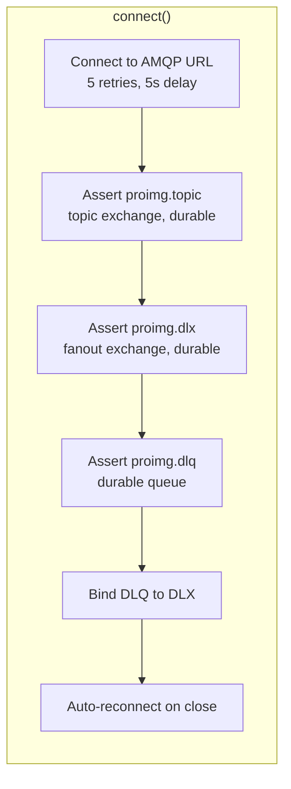
```mermaid
flowchart LR
    subgraph "connect()"
        A[Connect to AMQP URL<br/>5 retries, 5s delay] --> B[Assert proimg.topic<br/>topic exchange, durable]
        B --> C[Assert proimg.dlx<br/>fanout exchange, durable]
        C --> D[Assert proimg.dlq<br/>durable queue]
        D --> E[Bind DLQ to DLX]
        E --> F[Auto-reconnect on close]
    end
```

- **`publish(routingKey, data, correlationId)`**: Wraps data in envelope `{event, timestamp, correlationId, data}`, publishes with `persistent: true`
- **`subscribe(queue, routingKeys, handler)`**: Creates durable queue with DLX arguments, binds routing keys, `prefetch(1)`. On success → ack. On failure with `deathCount < 3` → requeue. On `deathCount >= 3` → nack to DLQ.

### `isAuth` Middleware Flow
```
Request → Read token from cookie OR Authorization header
  → jwt.verify(token, JWT_SEC)
    → Success: req.user = { _id, id, email, name } → next()
    → Any error: 401 "Authentication failed"
```

### EVENTS Constants
```js
{
  USER_REGISTERED: "user.registered",
  USER_UPDATED: "user.updated",
  USER_DELETED: "user.deleted",
  NOTIFICATION_TRIGGERED: "notification.triggered",
  SOCIAL_ACTIVITY: "social.activity",
  MESSAGE_RECEIVED: "message.received",
  ENTITY_CREATED: "entity.created",
  ENTITY_UPDATED: "entity.updated",
  ENTITY_DELETED: "entity.deleted"
}
```

---

## Gateway Service — The Front Door

**Single file**: [server.js](file:///Users/pratik/folders/Proimg/ProImg/services/gateway/server.js) (~212 lines)

The Gateway performs **zero business logic**. It's a transparent proxy with security middleware.

### Middleware Chain (in order)
1. **Helmet** — Secure HTTP headers (CSP disabled, cross-origin resource policy: cross-origin)
2. **CORS** — Origins: `localhost:5173`, `5174`, `3000`, + `FRONTEND_URL`. Credentials enabled.
3. **cookie-parser** — Parse cookies from requests
4. **express.json()** + **express.urlencoded()** — Body parsing
5. **Correlation ID** — Generates/forwards `X-Correlation-ID` (`crypto.randomUUID()`), creates scoped `req.logger`
6. **Morgan** — HTTP request logging with correlation ID
7. **Rate Limiter** — 2000 requests per 15-minute window per IP

### Proxy Routes

| Gateway Path | → Proxied To | Special Handling |
|---|---|---|
| `/api/user/*` | Auth Service `:5001` | `parseReqBody: true` |
| `/api/pin/*` | Pin Service `:5002` | `parseReqBody: false` for multipart (file uploads) |
| `/api/message/*` | Chat Service `:5003` | Standard proxy |
| `/api/notifications/*` | Notification Service `:5006` | `parseReqBody: true` |
| `/socket.io` | Chat Service `:5003` | HTTP long-polling via `wsProxy.web()` |

> [!IMPORTANT]
> The `/api/pin` proxy **dynamically detects** `multipart` content-type and sets `parseReqBody: false` to stream file uploads directly — this is critical for image/video uploads to work.

### WebSocket Proxy
```
Client WebSocket upgrade → server.on('upgrade')
  → Only /socket.io paths accepted (others destroyed)
  → wsProxy.ws(req, socket, head) → Chat Service:5003
```

### Health Check (`GET /health`)
Probes all 4 downstream services' `/health` endpoints in parallel with `fetch`. Returns `"healthy"`, `"unhealthy (statusCode)"`, or `"offline (error)"` per service. Always returns HTTP 200.

---

## Action Flows — Authentication

### 1. User Registration (OTP-based)

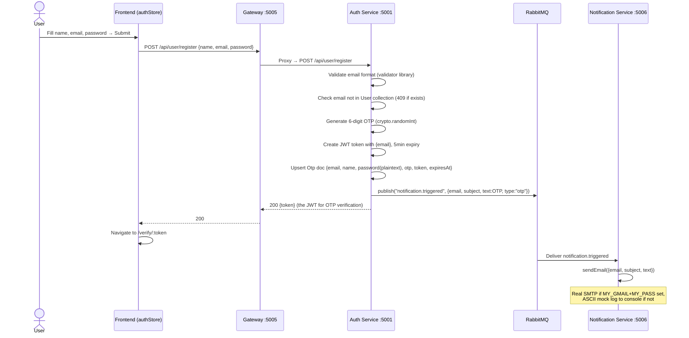
```mermaid
sequenceDiagram
    actor User
    participant FE as Frontend (authStore)
    participant GW as Gateway :5005
    participant Auth as Auth Service :5001
    participant RMQ as RabbitMQ
    participant Notif as Notification Service :5006

    User->>FE: Fill name, email, password → Submit
    FE->>GW: POST /api/user/register {name, email, password}
    GW->>Auth: Proxy → POST /api/user/register

    Auth->>Auth: Validate email format (validator library)
    Auth->>Auth: Check email not in User collection (409 if exists)
    Auth->>Auth: Generate 6-digit OTP (crypto.randomInt)
    Auth->>Auth: Create JWT token with {email}, 5min expiry
    Auth->>Auth: Upsert Otp doc {email, name, password(plaintext), otp, token, expiresAt}
    Auth->>RMQ: publish("notification.triggered", {email, subject, text:OTP, type:"otp"})
    Auth-->>GW: 200 {token} (the JWT for OTP verification)
    GW-->>FE: 200
    FE->>FE: Navigate to /verify/:token

    RMQ->>Notif: Deliver notification.triggered
    Notif->>Notif: sendEmail({email, subject, text})
    Note over Notif: Real SMTP if MY_GMAIL+MY_PASS set,<br/>ASCII mock log to console if not
```

> [!NOTE]
> The OTP doc stores the **plaintext password** temporarily. It's hashed with bcrypt only upon successful OTP verification. The Otp collection has a MongoDB TTL index — docs auto-expire after 5 minutes. A cron job also cleans up every 15 minutes as a safety net.

### 2. OTP Verification & Account Creation

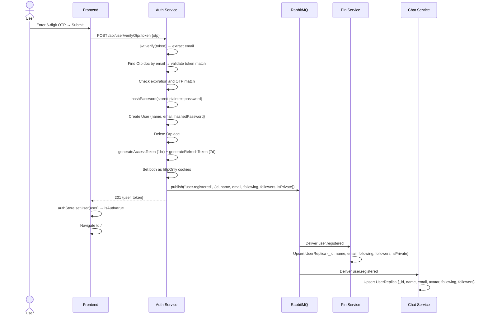
```mermaid
sequenceDiagram
    actor User
    participant FE as Frontend
    participant Auth as Auth Service
    participant RMQ as RabbitMQ
    participant Pin as Pin Service
    participant Chat as Chat Service

    User->>FE: Enter 6-digit OTP → Submit
    FE->>Auth: POST /api/user/verifyOtp/:token {otp}

    Auth->>Auth: jwt.verify(token) → extract email
    Auth->>Auth: Find Otp doc by email → validate token match
    Auth->>Auth: Check expiration and OTP match
    Auth->>Auth: hashPassword(stored plaintext password)
    Auth->>Auth: Create User {name, email, hashedPassword}
    Auth->>Auth: Delete Otp doc
    Auth->>Auth: generateAccessToken (1hr) + generateRefreshToken (7d)
    Auth->>Auth: Set both as httpOnly cookies
    Auth->>RMQ: publish("user.registered", {id, name, email, following, followers, isPrivate})
    Auth-->>FE: 201 {user, token}

    FE->>FE: authStore.setUser(user) → isAuth=true
    FE->>FE: Navigate to /

    RMQ->>Pin: Deliver user.registered
    Pin->>Pin: Upsert UserReplica {_id, name, email, following, followers, isPrivate}

    RMQ->>Chat: Deliver user.registered
    Chat->>Chat: Upsert UserReplica {_id, name, email, avatar, following, followers}
```

### 3. Login

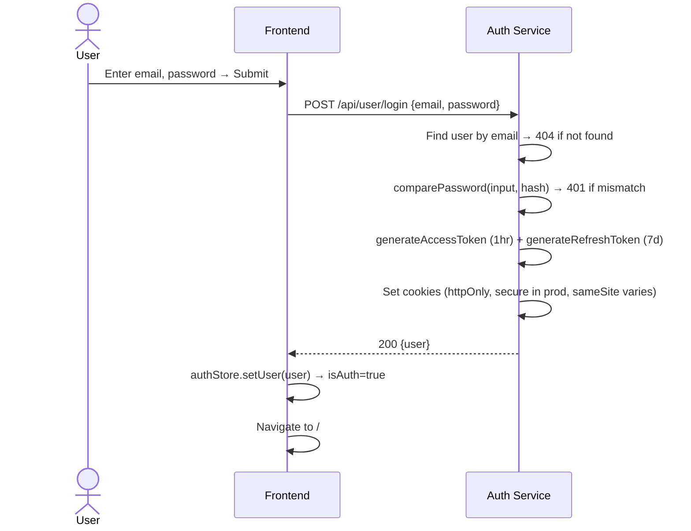
```mermaid
sequenceDiagram
    actor User
    participant FE as Frontend
    participant Auth as Auth Service

    User->>FE: Enter email, password → Submit
    FE->>Auth: POST /api/user/login {email, password}

    Auth->>Auth: Find user by email → 404 if not found
    Auth->>Auth: comparePassword(input, hash) → 401 if mismatch
    Auth->>Auth: generateAccessToken (1hr) + generateRefreshToken (7d)
    Auth->>Auth: Set cookies (httpOnly, secure in prod, sameSite varies)
    Auth-->>FE: 200 {user}

    FE->>FE: authStore.setUser(user) → isAuth=true
    FE->>FE: Navigate to /
```

### 4. Google OAuth Login

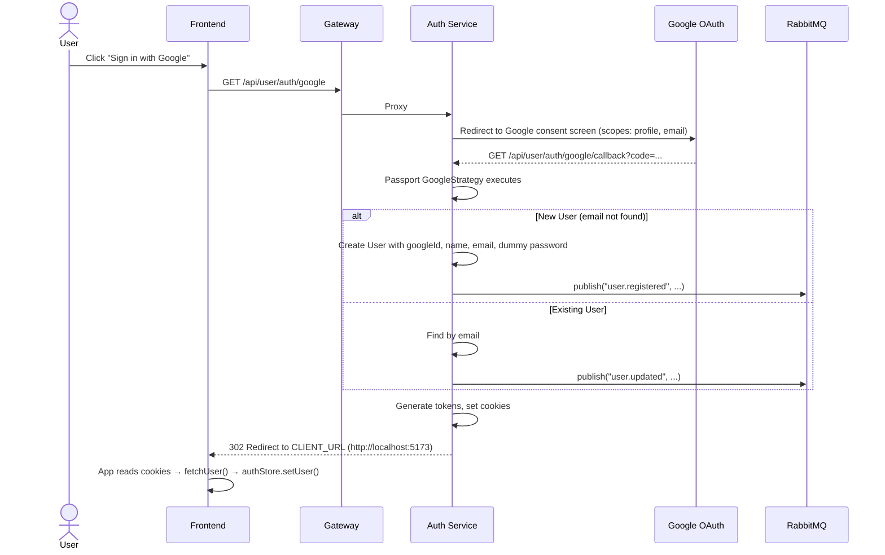
```mermaid
sequenceDiagram
    actor User
    participant FE as Frontend
    participant GW as Gateway
    participant Auth as Auth Service
    participant Google as Google OAuth
    participant RMQ as RabbitMQ

    User->>FE: Click "Sign in with Google"
    FE->>GW: GET /api/user/auth/google
    GW->>Auth: Proxy
    Auth->>Google: Redirect to Google consent screen (scopes: profile, email)
    Google-->>Auth: GET /api/user/auth/google/callback?code=...

    Auth->>Auth: Passport GoogleStrategy executes
    alt New User (email not found)
        Auth->>Auth: Create User with googleId, name, email, dummy password
        Auth->>RMQ: publish("user.registered", ...)
    else Existing User
        Auth->>Auth: Find by email
        Auth->>RMQ: publish("user.updated", ...)
    end

    Auth->>Auth: Generate tokens, set cookies
    Auth-->>FE: 302 Redirect to CLIENT_URL (http://localhost:5173)
    FE->>FE: App reads cookies → fetchUser() → authStore.setUser()
```

### 5. Silent Token Refresh (Axios Interceptor)

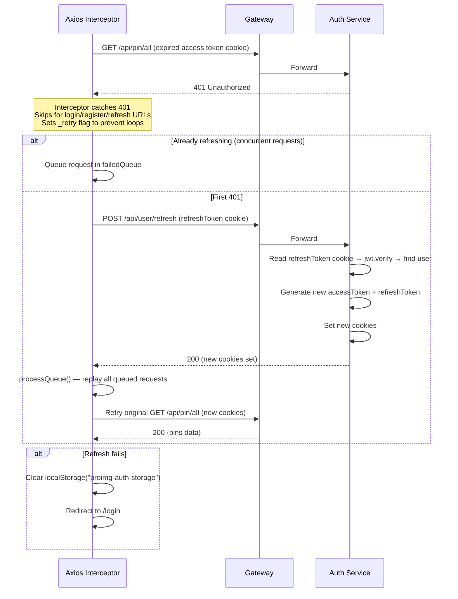
```mermaid
sequenceDiagram
    participant FE as Axios Interceptor
    participant GW as Gateway
    participant Auth as Auth Service

    FE->>GW: GET /api/pin/all (expired access token cookie)
    GW->>Auth: Forward
    Auth-->>FE: 401 Unauthorized

    Note over FE: Interceptor catches 401<br/>Skips for login/register/refresh URLs<br/>Sets _retry flag to prevent loops

    alt Already refreshing (concurrent requests)
        FE->>FE: Queue request in failedQueue
    else First 401
        FE->>GW: POST /api/user/refresh (refreshToken cookie)
        GW->>Auth: Forward
        Auth->>Auth: Read refreshToken cookie → jwt.verify → find user
        Auth->>Auth: Generate new accessToken + refreshToken
        Auth->>Auth: Set new cookies
        Auth-->>FE: 200 (new cookies set)

        FE->>FE: processQueue() — replay all queued requests
        FE->>GW: Retry original GET /api/pin/all (new cookies)
        GW-->>FE: 200 {pins data}
    end

    alt Refresh fails
        FE->>FE: Clear localStorage("proimg-auth-storage")
        FE->>FE: Redirect to /login
    end
```

### 6. Logout

```
FE → GET /api/user/logout
Auth → isAuth middleware verifies token
Auth → Clear both `token` and `refreshToken` cookies → 200
FE → authStore: setUser(null), isAuth=false
FE → Clear localStorage → Navigate to /login
```

### 7. Forgot Password

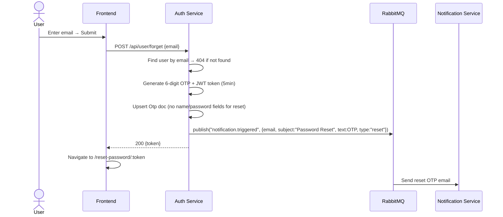
```mermaid
sequenceDiagram
    actor User
    participant FE as Frontend
    participant Auth as Auth Service
    participant RMQ as RabbitMQ
    participant Notif as Notification Service

    User->>FE: Enter email → Submit
    FE->>Auth: POST /api/user/forget {email}
    Auth->>Auth: Find user by email → 404 if not found
    Auth->>Auth: Generate 6-digit OTP + JWT token (5min)
    Auth->>Auth: Upsert Otp doc (no name/password fields for reset)
    Auth->>RMQ: publish("notification.triggered", {email, subject:"Password Reset", text:OTP, type:"reset"})
    Auth-->>FE: 200 {token}
    FE->>FE: Navigate to /reset-password/:token

    RMQ->>Notif: Send reset OTP email
```

### 8. Reset Password

```
FE → POST /api/user/reset-password/:token {otp, password}
Auth → jwt.verify(token) → extract email
Auth → Find Otp doc → validate token + expiration + OTP match
Auth → Find user by email → hashPassword(newPassword) → save
Auth → Delete Otp doc → 200
FE → Navigate to /login
```

---

## Action Flows — User Management

### 9. View Own Profile

```
FE → GET /api/user/me (cookie-based auth)
Auth → isAuth middleware → find User by req.user.id
Auth → Return full user object (sans password)
```

### 10. View Other User's Profile

```
FE → GET /api/user/:id
Auth → isAuth → find User by :id
Auth → profileAccess.formatUserForViewer(user, viewerId):
  - Determines relationship: 'self' | 'following' | 'requested' | 'none'
  - If private + not following: hides follower counts
  - Strips password
Auth → Return formatted user with relationship info
```

### 11. Update Privacy (Toggle Private/Public)

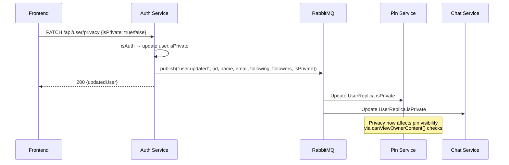
```mermaid
sequenceDiagram
    participant FE as Frontend
    participant Auth as Auth Service
    participant RMQ as RabbitMQ
    participant Pin as Pin Service
    participant Chat as Chat Service

    FE->>Auth: PATCH /api/user/privacy {isPrivate: true/false}
    Auth->>Auth: isAuth → update user.isPrivate
    Auth->>RMQ: publish("user.updated", {id, name, email, following, followers, isPrivate})
    Auth-->>FE: 200 {updatedUser}

    RMQ->>Pin: Update UserReplica.isPrivate
    RMQ->>Chat: Update UserReplica.isPrivate
    Note over Pin: Privacy now affects pin visibility<br/>via canViewOwnerContent() checks
```

### 12. Follow a Public User

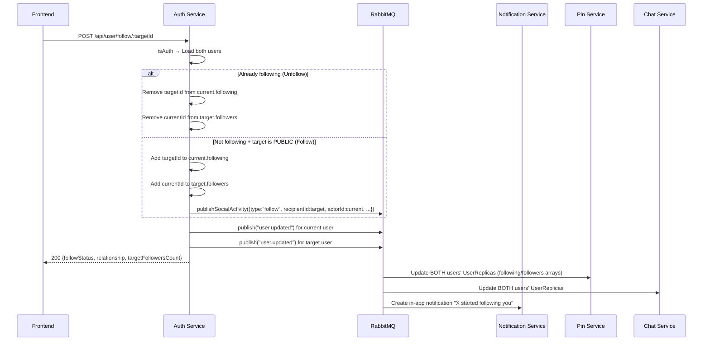
```mermaid
sequenceDiagram
    participant FE as Frontend
    participant Auth as Auth Service
    participant RMQ as RabbitMQ
    participant Notif as Notification Service
    participant Pin as Pin Service
    participant Chat as Chat Service

    FE->>Auth: POST /api/user/follow/:targetId
    Auth->>Auth: isAuth → Load both users

    alt Already following (Unfollow)
        Auth->>Auth: Remove targetId from current.following
        Auth->>Auth: Remove currentId from target.followers
    else Not following + target is PUBLIC (Follow)
        Auth->>Auth: Add targetId to current.following
        Auth->>Auth: Add currentId to target.followers
        Auth->>RMQ: publishSocialActivity({type:"follow", recipientId:target, actorId:current, ...})
    end

    Auth->>RMQ: publish("user.updated") for current user
    Auth->>RMQ: publish("user.updated") for target user
    Auth-->>FE: 200 {followStatus, relationship, targetFollowersCount}

    RMQ->>Pin: Update BOTH users' UserReplicas (following/followers arrays)
    RMQ->>Chat: Update BOTH users' UserReplicas
    RMQ->>Notif: Create in-app notification "X started following you"
```

### 13. Follow a Private User (Follow Request)

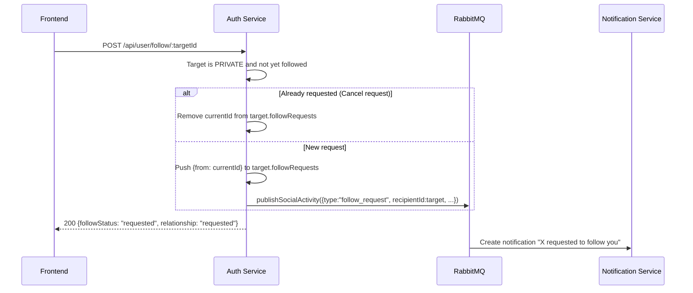
```mermaid
sequenceDiagram
    participant FE as Frontend
    participant Auth as Auth Service
    participant RMQ as RabbitMQ
    participant Notif as Notification Service

    FE->>Auth: POST /api/user/follow/:targetId
    Auth->>Auth: Target is PRIVATE and not yet followed

    alt Already requested (Cancel request)
        Auth->>Auth: Remove currentId from target.followRequests
    else New request
        Auth->>Auth: Push {from: currentId} to target.followRequests
        Auth->>RMQ: publishSocialActivity({type:"follow_request", recipientId:target, ...})
    end

    Auth-->>FE: 200 {followStatus: "requested", relationship: "requested"}
    RMQ->>Notif: Create notification "X requested to follow you"
```

### 14. Accept Follow Request

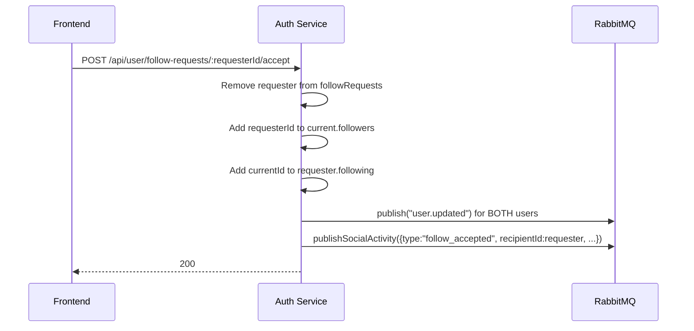
```mermaid
sequenceDiagram
    participant FE as Frontend
    participant Auth as Auth Service
    participant RMQ as RabbitMQ

    FE->>Auth: POST /api/user/follow-requests/:requesterId/accept
    Auth->>Auth: Remove requester from followRequests
    Auth->>Auth: Add requesterId to current.followers
    Auth->>Auth: Add currentId to requester.following
    Auth->>RMQ: publish("user.updated") for BOTH users
    Auth->>RMQ: publishSocialActivity({type:"follow_accepted", recipientId:requester, ...})
    Auth-->>FE: 200
```

### 15. Reject Follow Request

```
FE → POST /api/user/follow-requests/:requesterId/reject
Auth → Remove requester from followRequests array → 200
```

### 16. Get Follow Requests

```
FE → GET /api/user/follow-requests
Auth → isAuth → Return user.followRequests (populated with name, email)
```

### 17. Get Followers & Following Lists

```
FE → GET /api/user/get/:id
Auth → Find user, populate followers + following (name, email) → 200
```

### 18. Get All Users

```
FE → GET /api/user/all
Auth → User.find() → formatUserForViewer() for each
  → Returns users with relationship info per viewer
```

### 19. Sync User Replicas (Admin)

```
FE → POST /api/user/sync-replicas
Auth → isAuth → Iterate ALL users
  → publish("user.registered") for each user
  → Forces Pin + Chat services to re-sync all UserReplicas
```

### 20. Upload E2EE Public Key

```
FE → POST /api/user/keys {publicKey: JWK object}
Auth → isAuth → Save publicKey on user doc → 200
```

### 21. Delete Account

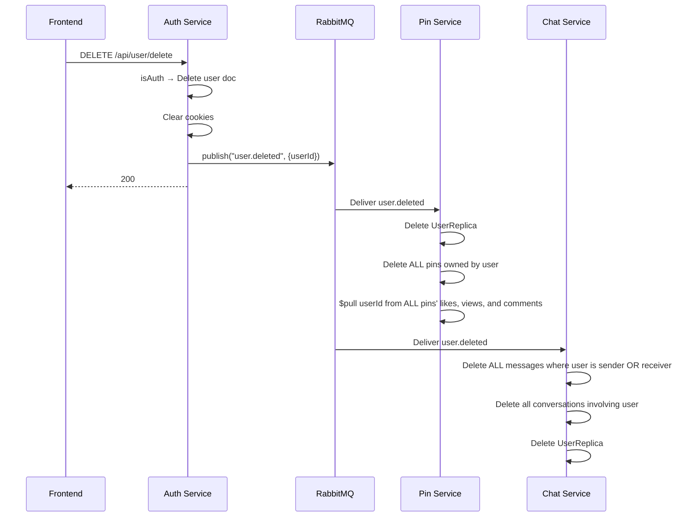
```mermaid
sequenceDiagram
    participant FE as Frontend
    participant Auth as Auth Service
    participant RMQ as RabbitMQ
    participant Pin as Pin Service
    participant Chat as Chat Service

    FE->>Auth: DELETE /api/user/delete
    Auth->>Auth: isAuth → Delete user doc
    Auth->>Auth: Clear cookies
    Auth->>RMQ: publish("user.deleted", {userId})
    Auth-->>FE: 200

    RMQ->>Pin: Deliver user.deleted
    Pin->>Pin: Delete UserReplica
    Pin->>Pin: Delete ALL pins owned by user
    Pin->>Pin: $pull userId from ALL pins' likes, views, and comments

    RMQ->>Chat: Deliver user.deleted
    Chat->>Chat: Delete ALL messages where user is sender OR receiver
    Chat->>Chat: Delete all conversations involving user
    Chat->>Chat: Delete UserReplica
```

---

## Action Flows — Pins

### 22. Create Pin (Image/Video Upload)

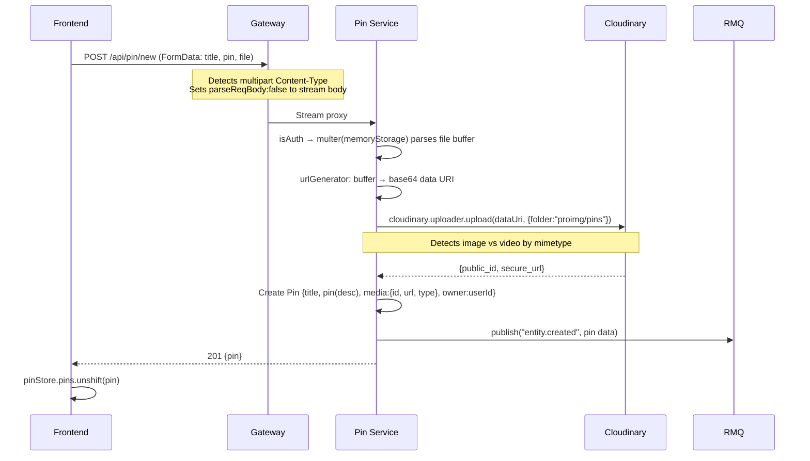
```mermaid
sequenceDiagram
    participant FE as Frontend
    participant GW as Gateway
    participant Pin as Pin Service
    participant Cloud as Cloudinary

    FE->>GW: POST /api/pin/new (FormData: title, pin, file)
    Note over GW: Detects multipart Content-Type<br/>Sets parseReqBody:false to stream body
    GW->>Pin: Stream proxy

    Pin->>Pin: isAuth → multer(memoryStorage) parses file buffer
    Pin->>Pin: urlGenerator: buffer → base64 data URI
    Pin->>Cloud: cloudinary.uploader.upload(dataUri, {folder:"proimg/pins"})
    Note over Pin,Cloud: Detects image vs video by mimetype
    Cloud-->>Pin: {public_id, secure_url}
    Pin->>Pin: Create Pin {title, pin(desc), media:{id, url, type}, owner:userId}
    Pin->>RMQ: publish("entity.created", pin data)
    Pin-->>FE: 201 {pin}
    FE->>FE: pinStore.pins.unshift(pin)
```

### 23. Get Feed — Discover Mode

```
FE → GET /api/pin/all
Pin → isAuth → Pin.find().populate("owner", "name email").sort({createdAt: -1})
  → canViewOwnerContent(viewerId, ownerId) for EACH pin
    → If owner is private AND viewer is NOT a follower → EXCLUDE pin
  → Return filtered pins
```

### 24. Get Feed — Following Mode

```
FE → GET /api/pin/feed
Pin → isAuth → Load viewer's UserReplica → get following list
  → Pin.find({owner: {$in: [self, ...following]}})
  → Sort by createdAt desc → Return pins
```

### 25. Get Single Pin

```
FE → GET /api/pin/:id
Pin → isAuth → Pin.findById(id).populate("owner")
  → canViewOwnerContent() privacy check → 403 if blocked
  → Return pin
```

### 26. Get User's Pins

```
FE → GET /api/pin/user/:ownerId
Pin → isAuth → canViewOwnerContent(viewerId, ownerId) → 403 if private
  → Pin.find({owner: ownerId}).populate("owner").sort({createdAt: -1})
```

### 27. Update Pin (Title/Description only)

```
FE → PUT /api/pin/:id {title, pin}
Pin → isAuth → Find pin → Verify pin.owner === req.user.id (403 if not)
  → Update title and/or pin (description) — no media re-upload
  → publish("entity.updated") → 200 {updatedPin}
```

### 28. Delete Pin

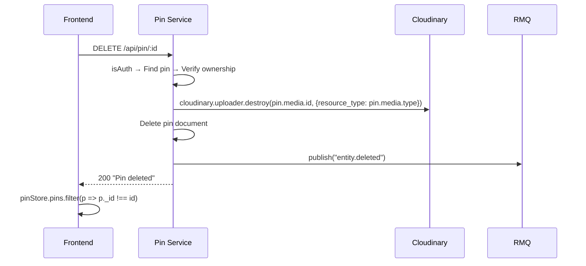
```mermaid
sequenceDiagram
    participant FE as Frontend
    participant Pin as Pin Service
    participant Cloud as Cloudinary

    FE->>Pin: DELETE /api/pin/:id
    Pin->>Pin: isAuth → Find pin → Verify ownership
    Pin->>Cloud: cloudinary.uploader.destroy(pin.media.id, {resource_type: pin.media.type})
    Pin->>Pin: Delete pin document
    Pin->>RMQ: publish("entity.deleted")
    Pin-->>FE: 200 "Pin deleted"
    FE->>FE: pinStore.pins.filter(p => p._id !== id)
```

### 29. Like / Unlike Pin

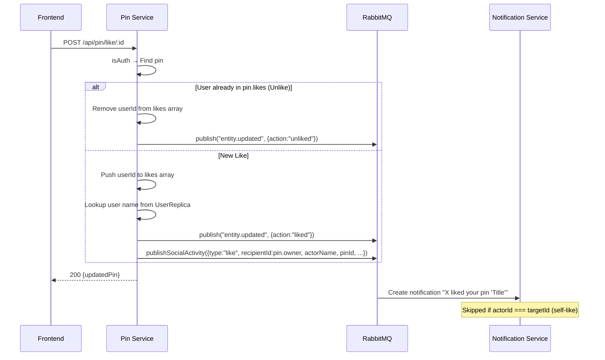
```mermaid
sequenceDiagram
    participant FE as Frontend
    participant Pin as Pin Service
    participant RMQ as RabbitMQ
    participant Notif as Notification Service

    FE->>Pin: POST /api/pin/like/:id
    Pin->>Pin: isAuth → Find pin

    alt User already in pin.likes (Unlike)
        Pin->>Pin: Remove userId from likes array
        Pin->>RMQ: publish("entity.updated", {action:"unliked"})
    else New Like
        Pin->>Pin: Push userId to likes array
        Pin->>Pin: Lookup user name from UserReplica
        Pin->>RMQ: publish("entity.updated", {action:"liked"})
        Pin->>RMQ: publishSocialActivity({type:"like", recipientId:pin.owner, actorName, pinId, ...})
    end

    Pin-->>FE: 200 {updatedPin}

    RMQ->>Notif: Create notification "X liked your pin 'Title'"
    Note over Notif: Skipped if actorId === targetId (self-like)
```

### 30. Add Comment

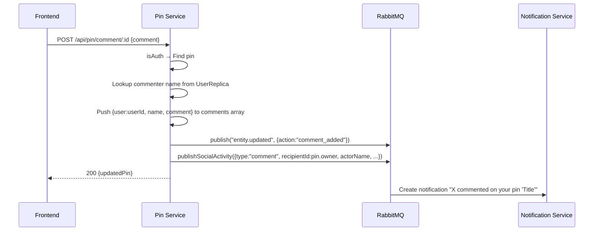
```mermaid
sequenceDiagram
    participant FE as Frontend
    participant Pin as Pin Service
    participant RMQ as RabbitMQ
    participant Notif as Notification Service

    FE->>Pin: POST /api/pin/comment/:id {comment}
    Pin->>Pin: isAuth → Find pin
    Pin->>Pin: Lookup commenter name from UserReplica
    Pin->>Pin: Push {user:userId, name, comment} to comments array
    Pin->>RMQ: publish("entity.updated", {action:"comment_added"})
    Pin->>RMQ: publishSocialActivity({type:"comment", recipientId:pin.owner, actorName, ...})
    Pin-->>FE: 200 {updatedPin}

    RMQ->>Notif: Create notification "X commented on your pin 'Title'"
```

### 31. Delete Comment

```
FE → DELETE /api/pin/comment/:pinId?commentId=...
Pin → isAuth → Find pin → Find comment by commentId
  → Verify comment.user === req.user.id (only commenter can delete)
  → Splice comment from array → publish("entity.updated") → 200
```

### 32. Record View

```
FE → POST /api/pin/view {pinId}
Pin → isAuth → Find pin
  → If userId NOT in views array → push userId
  → publish("entity.updated", {action:"viewed"}) → 200
```

### 33. Get Likes List

```
FE → GET /api/pin/likes/:pinId
Pin → Return pin.likes populated with user name
```

### 34. Get User's Liked Pins

```
FE → GET /api/pin/liked/:userId
Pin → Pin.find({likes: userId}) → Return all pins the user has liked
```

### 35. Get Views List

```
FE → GET /api/pin/getView/:pinId
Pin → Return pin.views populated with user name
```

---

## Action Flows — Chat & Messaging

### 36. Get All Conversations

```
FE → GET /api/message/conversations
Chat → isAuth → Aggregation pipeline:
  → Find Messages where sender or receiver is userId
  → Group by conversation partner
  → Lookup partner details from UserReplica ($lookup from: "users")
  → Calculate unread count per conversation
  → Sort by last message timestamp desc
  → Return with partner info + lastMessage + unreadCount
```

### 37. Start a Conversation / Get Chat History

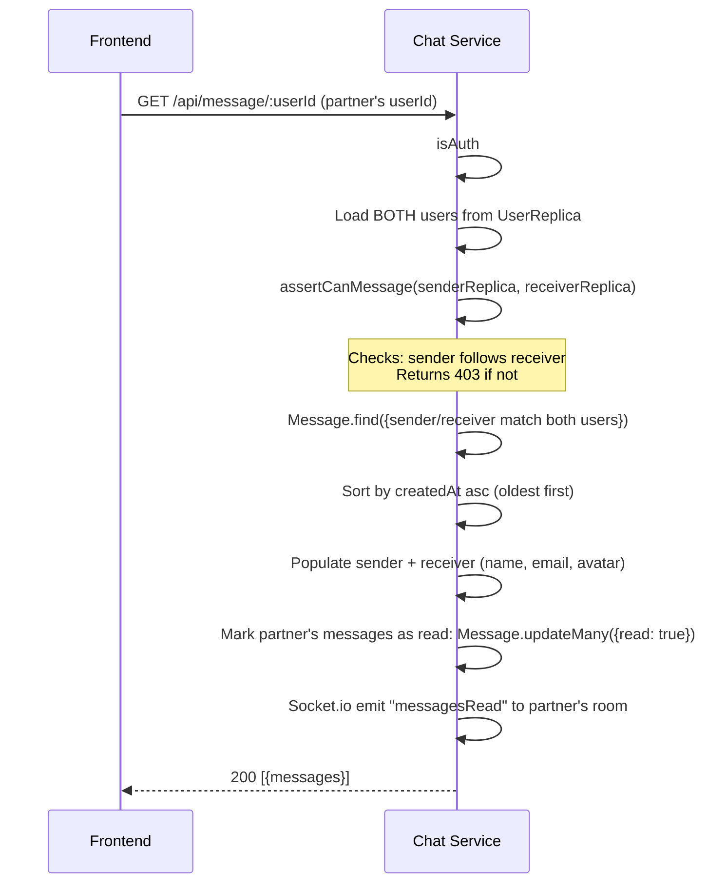
```mermaid
sequenceDiagram
    participant FE as Frontend
    participant Chat as Chat Service

    FE->>Chat: GET /api/message/:userId (partner's userId)
    Chat->>Chat: isAuth

    Chat->>Chat: Load BOTH users from UserReplica
    Chat->>Chat: assertCanMessage(senderReplica, receiverReplica)
    Note over Chat: Checks: sender follows receiver<br/>Returns 403 if not

    Chat->>Chat: Message.find({sender/receiver match both users})
    Chat->>Chat: Sort by createdAt asc (oldest first)
    Chat->>Chat: Populate sender + receiver (name, email, avatar)

    Chat->>Chat: Mark partner's messages as read: Message.updateMany({read: true})
    Chat->>Chat: Socket.io emit "messagesRead" to partner's room

    Chat-->>FE: 200 [{messages}]
```

> [!IMPORTANT]
> The follow check is **one-directional**: the sender must follow the receiver. Despite the function being named `areMutualFriends()`, it only checks if userA follows userB — not bidirectional mutual following.

### 38. Send Message (HTTP + WebSocket + RabbitMQ + E2EE)

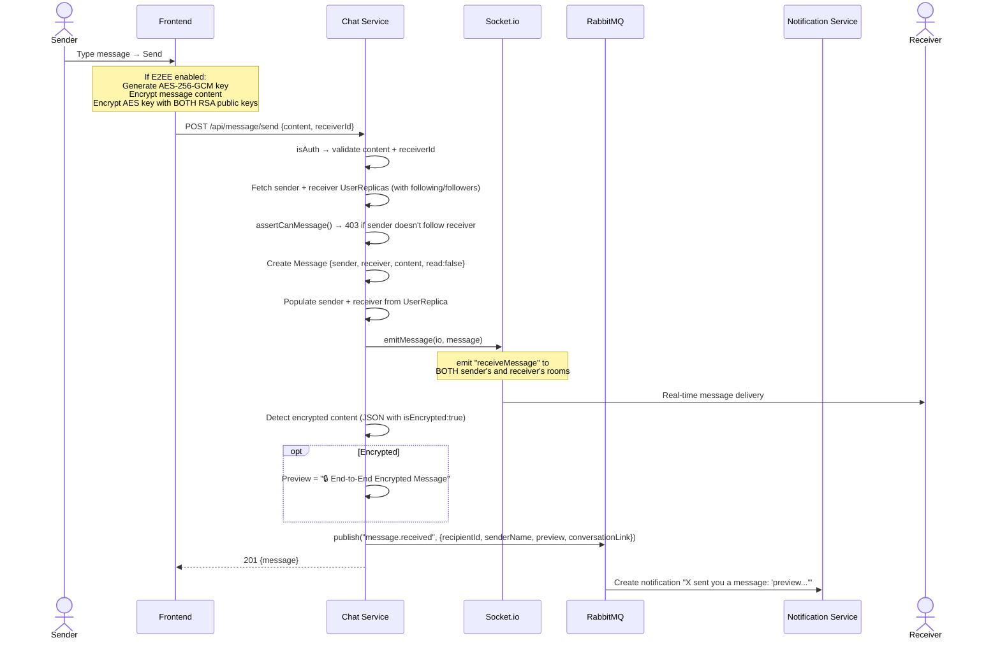
```mermaid
sequenceDiagram
    actor Sender
    participant FE as Frontend
    participant Chat as Chat Service
    participant Socket as Socket.io
    participant RMQ as RabbitMQ
    participant Notif as Notification Service
    actor Receiver

    Sender->>FE: Type message → Send
    Note over FE: If E2EE enabled:<br/>Generate AES-256-GCM key<br/>Encrypt message content<br/>Encrypt AES key with BOTH RSA public keys

    FE->>Chat: POST /api/message/send {content, receiverId}
    Chat->>Chat: isAuth → validate content + receiverId
    Chat->>Chat: Fetch sender + receiver UserReplicas (with following/followers)
    Chat->>Chat: assertCanMessage() → 403 if sender doesn't follow receiver

    Chat->>Chat: Create Message {sender, receiver, content, read:false}
    Chat->>Chat: Populate sender + receiver from UserReplica

    Chat->>Socket: emitMessage(io, message)
    Note over Socket: emit "receiveMessage" to<br/>BOTH sender's and receiver's rooms
    Socket->>Receiver: Real-time message delivery

    Chat->>Chat: Detect encrypted content (JSON with isEncrypted:true)
    opt Encrypted
        Chat->>Chat: Preview = "🔒 End-to-End Encrypted Message"
    end

    Chat->>RMQ: publish("message.received", {recipientId, senderName, preview, conversationLink})
    Chat-->>FE: 201 {message}

    RMQ->>Notif: Create notification "X sent you a message: 'preview...'"
```

### 39. Mark Single Message as Read

```
FE → PUT /api/message/read/:messageId
Chat → isAuth → Find message → Verify receiver === req.user.id
  → Set message.read = true
  → Socket.io emit "messageReadUpdate" to sender's room
  → 200
```

### 40. Delete Message

```
FE → DELETE /api/message/:messageId
Chat → isAuth → Find message → Verify sender === req.user.id
  → Delete message
  → Socket.io emit "messageDeleted" to receiver's room
  → 200
```

### 41. WebSocket Connection Flow

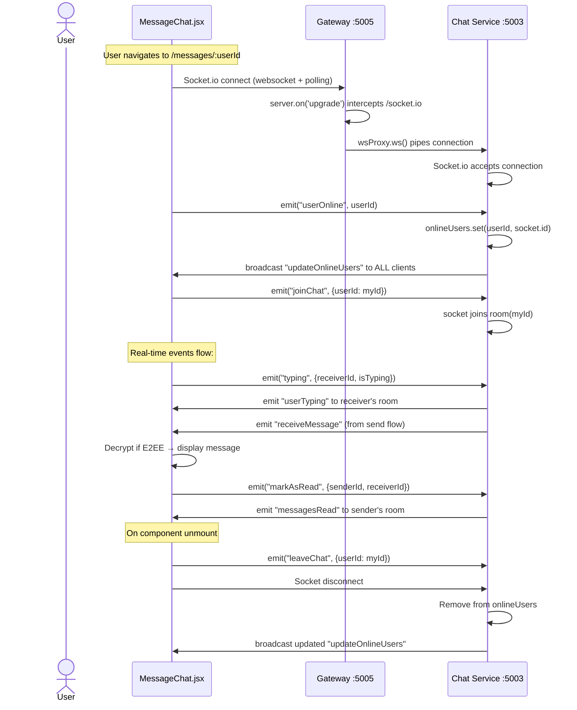
```mermaid
sequenceDiagram
    actor User
    participant FE as MessageChat.jsx
    participant GW as Gateway :5005
    participant Chat as Chat Service :5003

    Note over FE: User navigates to /messages/:userId

    FE->>GW: Socket.io connect (websocket + polling)
    GW->>GW: server.on('upgrade') intercepts /socket.io
    GW->>Chat: wsProxy.ws() pipes connection
    Chat->>Chat: Socket.io accepts connection

    FE->>Chat: emit("userOnline", userId)
    Chat->>Chat: onlineUsers.set(userId, socket.id)
    Chat->>FE: broadcast "updateOnlineUsers" to ALL clients

    FE->>Chat: emit("joinChat", {userId: myId})
    Chat->>Chat: socket joins room(myId)

    Note over FE: Real-time events flow:
    FE->>Chat: emit("typing", {receiverId, isTyping})
    Chat->>FE: emit "userTyping" to receiver's room

    Chat->>FE: emit "receiveMessage" (from send flow)
    FE->>FE: Decrypt if E2EE → display message

    FE->>Chat: emit("markAsRead", {senderId, receiverId})
    Chat->>FE: emit "messagesRead" to sender's room

    Note over FE: On component unmount
    FE->>Chat: emit("leaveChat", {userId: myId})
    FE->>Chat: Socket disconnect
    Chat->>Chat: Remove from onlineUsers
    Chat->>FE: broadcast updated "updateOnlineUsers"
```

### E2EE (End-to-End Encryption)
The frontend implements **RSA-OAEP 2048-bit + AES-GCM-256** hybrid encryption:
1. Each user generates an RSA key pair stored in **localStorage** as JWK
2. Public key is synced to server via `POST /api/user/keys`
3. On send: random AES-256 key encrypts the message, then the AES key is encrypted with **both** sender's and receiver's RSA public keys
4. On receive: the correct encrypted AES key is decrypted with the user's private key, then the message content is decrypted
5. Server never sees plaintext — only ciphertext passes through

---

## Action Flows — Notifications

### 42. Get Notifications (Paginated)

```
FE → GET /api/notifications?limit=40&unread=true&page=1
Notif → isAuth → Notification.find({userId})
  → Filter by unread if requested
  → Sort by createdAt desc, paginate
  → Also count total + unreadCount
  → 200 {items, pagination, unreadCount}
```

### 43. Get Unread Count

```
FE (NotificationBell polls every 10s/30s) → GET /api/notifications/unread-count
Notif → isAuth → Notification.countDocuments({userId, read:false})
  → 200 {count}
```

### 44. Mark Notification as Read

```
FE → PATCH /api/notifications/:id/read
Notif → isAuth → Find by id + userId ownership check → set read:true → 200
```

### 45. Mark All as Read

```
FE → PATCH /api/notifications/read-all
Notif → isAuth → updateMany({userId, read:false}, {read:true})
  → 200 {modified: count}
```

### 46. Delete Notification

```
FE → DELETE /api/notifications/:id
Notif → isAuth → findOneAndDelete({_id, userId}) → 200
```

---

## RabbitMQ Event Topology

### Exchange & Queues

```mermaid
graph LR
    subgraph Publishers
        Auth["Auth Service"]
        Pin["Pin Service"]
        Chat["Chat Service"]
    end

    TopicEx["proimg.topic<br/>(topic exchange, durable)"]

    Auth -->|"user.registered<br/>user.updated<br/>user.deleted<br/>notification.triggered<br/>social.activity"| TopicEx
    Pin -->|"social.activity<br/>entity.created/updated/deleted"| TopicEx
    Chat -->|"message.received"| TopicEx

    subgraph Queues
        PinQ["pin-service-user-events-queue<br/>Keys: user.registered/updated/deleted"]
        ChatQ["chat-service-user-events-queue<br/>Keys: user.registered/updated/deleted"]
        NotifEmailQ["notification-service-emails-queue<br/>Key: notification.triggered"]
        NotifSocialQ["notification-service-social-queue<br/>Key: social.activity"]
        NotifMsgQ["notification-service-messages-queue<br/>Key: message.received"]
    end

    TopicEx --> PinQ
    TopicEx --> ChatQ
    TopicEx --> NotifEmailQ
    TopicEx --> NotifSocialQ
    TopicEx --> NotifMsgQ

    subgraph Dead Letter
        DLX["proimg.dlx<br/>(fanout exchange)"]
        DLQ["proimg.dlq"]
    end

    PinQ -.->|"nack after 3 failures"| DLX
    ChatQ -.->|"nack after 3 failures"| DLX
    NotifEmailQ -.->|"nack after 3 failures"| DLX
    NotifSocialQ -.->|"nack after 3 failures"| DLX
    NotifMsgQ -.->|"nack after 3 failures"| DLX
    DLX --> DLQ
```

### Complete Event Reference

| Routing Key | Publisher | Queue → Consumer | Payload Shape | Purpose |
|---|---|---|---|---|
| `user.registered` | Auth | Pin queue, Chat queue | `{id, name, email, following, followers, isPrivate}` | Create UserReplica in downstream services |
| `user.updated` | Auth | Pin queue, Chat queue | `{id, name, email, following, followers, isPrivate}` | Sync profile/follow changes to replicas |
| `user.deleted` | Auth | Pin queue, Chat queue | `{userId}` | Cascade delete all user data downstream |
| `notification.triggered` | Auth | Notification emails queue | `{email, subject, text, type}` | Send OTP / password reset emails |
| `social.activity` | Auth, Pin | Notification social queue | `{type, recipientId, recipientEmail, actorId, actorName, title, body, link, entityType, entityId}` | Create in-app + optional email notifications |
| `message.received` | Chat | Notification messages queue | `{recipientId, recipientEmail, senderId, senderName, preview, conversationLink}` | Create message notification |
| `entity.created/updated/deleted` | Pin | *(not consumed)* | Pin data | Published but no consumer currently — for future extensibility |

> [!NOTE]
> The Notification Service uses **3 separate queues** for its 3 event types, ensuring email processing doesn't block social notifications or vice versa.

---

## Cross-Service Data Replication

```mermaid
flowchart TD
    subgraph "Auth Service (Source of Truth)"
        UserModel["User Model<br/>(full: password, tokens, boards,<br/>followRequests, publicKey, etc.)"]
    end

    subgraph "Pin Service (Read Replica)"
        PinReplica["UserReplica registered as 'User'<br/>{_id, name, email, following,<br/>followers, isPrivate}"]
        PinModel["Pin.owner → ref 'User'<br/>→ local populate() ✅"]
        Privacy["canViewOwnerContent()<br/>checks replica's isPrivate + followers"]
    end

    subgraph "Chat Service (Read Replica)"
        ChatReplica["UserReplica registered as 'User'<br/>{_id, name, email, avatar,<br/>following, followers}"]
        MsgModel["Message.sender/receiver → ref 'User'<br/>→ local populate() ✅"]
        Access["areMutualFriends()<br/>checks replica's following array"]
    end

    UserModel -->|"user.registered<br/>via RabbitMQ"| PinReplica
    UserModel -->|"user.updated<br/>via RabbitMQ"| PinReplica
    UserModel -->|"user.registered<br/>via RabbitMQ"| ChatReplica
    UserModel -->|"user.updated<br/>via RabbitMQ"| ChatReplica
```

> [!IMPORTANT]
> Both replicas register as Mongoose model name `"User"`. This means `.populate("owner")`, `.populate("sender")`, and `$lookup from: "users"` all resolve against the **local** UserReplica collection — zero network roundtrips to the auth service.

---

## Frontend Architecture

### Tech Stack
React 18 + Vite + TailwindCSS 3 + Zustand (persisted) + Axios + Socket.io-client + Framer Motion

### Routes

| Path | Component | Protected? | Purpose |
|---|---|---|---|
| `/login` | Login | No | Email/password login |
| `/register` | Register | No | Registration form |
| `/verify/:token` | OtpVerify | No | OTP verification |
| `/forgot` | Forgot | No | Forgot password |
| `/reset-password/:token` | Reset | No | Reset password with OTP |
| `/` | Home | ✅ | Pin feed (Discover/Following toggle, Photos/Videos filter) |
| `/create` | Create | ✅ | Upload image/video + title/description |
| `/pin/:id` | PinPage | ✅ | Pin detail — media, comments, likes, edit/delete |
| `/account` | Account | ✅ | Own profile — pins, liked, privacy, follow requests |
| `/user/:id` | UserProfile | ✅ | Other user's profile — follow, message, private gate |
| `/get/:id` | UserConnections | ✅ | Followers/following tabs with search |
| `/messages` | Conversations | ✅ | Message inbox with unread badges, E2EE decryption |
| `/messages/:userId` | MessageChat | ✅ | 1:1 chat — Socket.io, E2EE, typing, read receipts |
| `/notifications` | Notifications | ✅ | Full notification list |

### Zustand Stores

| Store | Persisted? | State | Key Actions |
|---|---|---|---|
| `authStore` | ✅ localStorage | `{user, isAuth, btnLoading, loading}` | login, register, verify, logout, toggleFollow, updatePrivacy, followRequests, fetchUser |
| `pinStore` | No | `{pins, pin, loading, feedMode}` | fetchPins (discover/following), createPin, updatePin, deletePin, likePin, addComment, deleteComment, recordView |
| `notificationStore` | No | `{items, unreadCount, loading, error}` | fetchNotifications, fetchUnreadCount, markRead, markAllRead, deleteNotification |

### Axios Instance — [axios.js](file:///Users/pratik/folders/Proimg/ProImg/frontend/src/config/axios.js)

Key features:
1. **Base URL**: `VITE_API_URL` || `http://localhost:5005` (Gateway)
2. **`withCredentials: true`** — sends httpOnly cookies on every request
3. **Request interceptor**: Strips `Content-Type` for FormData (lets browser set multipart boundary)
4. **Response interceptor**: Unwraps `{success, message, data}` envelope → `response.data = data`
5. **401 handler**: Silent token refresh via `POST /api/user/refresh`, queues concurrent requests, replays on success
6. **Refresh failure**: Clears `localStorage`, redirects to `/login`

---

## Cron Jobs

### Auth Service — OTP Cleanup
| Schedule | Action |
|---|---|
| `*/15 * * * *` (every 15 min) | Delete expired Otp docs (`expiresAt < now`). Belt-and-suspenders with MongoDB TTL index. |

### Notification Service — [scheduler.js](file:///Users/pratik/folders/Proimg/ProImg/services/notification-service/jobs/scheduler.js)

| Job | Production Schedule | Dev/Fast Schedule | What it does |
|---|---|---|---|
| **Cleanup** | `0 3 * * *` (3 AM daily) | `*/2 * * * *` (every 2 min) | Deletes `read:true` notifications older than 30 days (0 days in fast mode) |
| **Weekly Digest** | `0 9 * * 1` (Monday 9 AM) | `*/3 * * * *` (every 3 min) | Aggregates unread notifications per user, sends summary email |
| **Heartbeat** | `0 * * * *` (hourly) | `*/1 * * * *` (every 1 min) | Logs heartbeat message |

> [!TIP]
> The notification schema also has a **90-day TTL index** on `createdAt` that auto-deletes ALL notifications regardless of read status — a hard upper bound on data retention.

In **fast/dev mode** (`CRON_FAST=true` or `NODE_ENV=development`), all jobs are also triggered once 8 seconds after server startup. You can also manually trigger via `POST /health/run-jobs`.

---

## Complete Request Lifecycle Example

Here's the **end-to-end flow** when a user likes a pin:

```
 1. User clicks ❤️ on a pin in React frontend
 2. pinStore.likePin(pinId) → customAxios POST /api/pin/like/:id
 3. Axios request interceptor: withCredentials sends token cookie
 4. Request hits Gateway :5005
 5. Gateway: Helmet → CORS → cookieParser → Correlation ID → Morgan → Rate Limit
 6. Gateway: express-http-proxy routes /api/pin/* → Pin Service :5002
 7. Pin Service: isAuth middleware verifies JWT from cookie → req.user = {id, email, name}
 8. pinController.likeAndUnlike():
    a. Finds pin by ID
    b. Checks if user already in pin.likes array
    c. New like → pushes userId to likes array
    d. Looks up user's name from local UserReplica
    e. Publishes "social.activity" event to RabbitMQ via publishSocialActivity()
    f. Publishes "entity.updated" event
    g. Returns updated pin via successResponse()
 9. Response: Pin → Gateway → Axios interceptor (unwraps envelope)
10. Axios response.data = pin → pinStore updates → React re-renders with ❤️ filled
11. Meanwhile, RabbitMQ delivers "social.activity" to notification-service-social-queue
12. Notification Service handleSocialActivity():
    a. Skips if actorId === recipientId (self-like)
    b. Creates Notification doc: {userId:owner, type:"like", title:"X liked your pin 'Title'", ...}
    c. Optionally sends email if configured
13. Next time pin owner's NotificationBell polls /api/notifications/unread-count → badge increments
14. Owner opens notifications → sees "X liked your pin 'Mountain Sunset'"
```
